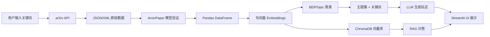

# 科研文献综述 AI 助手：完整学习计划与实施指南

---

## 📚 Part 1：总体架构与工作流

### 1.1 "科研厨房"类比

想象你要开一家"科研餐厅",为研究者做"文献大餐":

| 组件 | 厨房角色 | 技术实现 | 作用 |
|------|----------|----------|------|
| **arXiv API** | 进货渠道 | `arxiv` Python 包 | 按关键词获取论文"食材" |
| **Pandas DataFrame** | 食材整理台 | `pd.DataFrame` | 把 JSON 数据整理成表格 |
| **Sentence Embeddings** | 食材特征识别 | `sentence-transformers` | 把文本转成高维向量 |
| **BERTopic** | 厨房大脑 | `bertopic` 包 | 自动把论文分成不同主题（菜系） |
| **ChromaDB** | 知识冷库 | `chromadb` | 存储向量，支持相似度检索 |
| **LangChain + OpenAI** | 大厨 + 菜谱系统 | `langchain` + `openai` | 生成主题综述和摘要 |
| **FastAPI** | 后厨服务窗口 | `fastapi` + `pydantic` | 对外暴露 API 接口 |
| **Streamlit** | 前台点餐大屏 | `streamlit` | 用户交互界面 |

### 1.2 数据流：从 JSON 到可视化



**详细步骤解释：**

1. **用户输入** → **arXiv API**  
   用户在 Streamlit 前端输入 `"large language models"`，后端调用 arXiv API。

2. **JSON/XML** → **Pydantic 模型**  
   原始数据经过 `ArxivPaper` 模型验证，确保字段类型正确。

3. **列表** → **DataFrame**  
   `List[ArxivPaper]` 转成 `pd.DataFrame`，每行一篇论文。

4. **文本** → **向量**  
   用 `sentence-transformers` 将 `abstract` 转成 384/768 维向量。

5. **向量** → **主题簇**  
   BERTopic 内部：  
   - UMAP 降维（768维 → 5维）  
   - HDBSCAN 密度聚类（不需要预设簇数）  
   - class-based TF-IDF 提取每个簇的关键词

6. **主题簇** → **LLM 综述**  
   对某个 topic，收集所有论文摘要 → 用 LangChain 构建 prompt → 调用 OpenAI → 得到综述文本。

7. **向量** → **ChromaDB**  
   同时，向量也存进 ChromaDB，支持后续 RAG 检索。

8. **UI 展示**  
   Streamlit 调用 FastAPI 接口，展示主题分布、论文列表、LLM 总结、RAG 对话。

---

## 🗺️ Part 2：五阶段实战路线图

### Phase 1: Data Ingestion & 基础探索 ✅

**目标：**
- 从 arXiv 抓取 100+ 篇论文
- 转换为 DataFrame 并保存 CSV
- 进行初步数据分析

**学习要点：**
- arXiv API 的查询语法
- Pydantic 模型：为什么需要类型验证？
- Pandas 基础操作：DataFrame、筛选、统计

**核心代码模块：**
- `src/core/arxiv/models.py` - 数据模型
- `src/core/arxiv/client.py` - API 调用
- `src/core/arxiv/pipeline.py` - 数据转换
- `src/scripts/fetch_and_save_arxiv.py` - 命令行工具

**验收标准：**
- ✅ 成功生成 CSV 文件
- ✅ 能用 Jupyter 分析数据分布
- ✅ 理解 JSON → Model → DataFrame 流程

**时间估计：** 1-2 天

**参考文档：** `docs/PHASE1_GUIDE.md`

---

### Phase 2: Embedding & BERTopic 聚类 🔄

**目标：**
- 理解句向量的概念和作用
- 使用 BERTopic 自动发现主题
- 可视化主题分布

**学习要点：**
- **什么是 Embedding？**
  - 词向量 vs 句向量
  - BERT、Sentence-BERT 的直观理解
  - 为什么相似的文本在向量空间中距离近？

- **为什么用 BERTopic 而非 K-Means？**
  - K-Means 需要预设 k，BERTopic 自动确定簇数
  - BERTopic 使用 class-based TF-IDF 自动生成主题词
  - 更适合短文本（摘要）

- **BERTopic 工作流程：**
  1. 句向量（Sentence-BERT）
  2. UMAP 降维（保留语义结构）
  3. HDBSCAN 密度聚类（自适应簇数）
  4. class-based TF-IDF 主题词提取

**核心代码模块：**
- `src/core/nlp/embeddings.py` - 句向量生成
- `src/core/nlp/topic_modeling.py` - BERTopic 封装
- `src/scripts/train_bertopic.py` - 训练脚本
- `notebooks/02_bertopic_experiment.ipynb` - 实验 Notebook

**关键概念：**
- TF-IDF（词频-逆文档频率）
- class-based TF-IDF（BERTopic 的创新）
- UMAP（均匀流形逼近与投影）
- HDBSCAN（层次密度聚类）

**验收标准：**
- ✅ 成功训练 BERTopic 模型
- ✅ 得到每篇论文的 `topic_id`
- ✅ 可视化主题关键词和分布

**时间估计：** 2-3 天

**参考资料：**
- [BERTopic 论文](https://arxiv.org/abs/2203.05794)
- [BERTopic 官方文档](https://maartengr.github.io/BERTopic/)

---

### Phase 3: FastAPI Backend（生产级后端）

**目标：**
- 搭建 REST API 服务
- 封装 Phase 1-2 的功能为可调用接口
- 理解服务端开发规范

**学习要点：**
- **什么是 RESTful API？**
  - HTTP 方法（GET、POST）
  - 资源导向设计
  - 状态码（200、404、500）

- **为什么 FastAPI 需要 Pydantic？**
  - 请求验证（Request Validation）
  - 响应序列化（Response Serialization）
  - 自动生成 API 文档（Swagger UI）

- **同步 vs 异步端点：**
  - 什么时候用 `async def`？
  - IO-bound 任务适合异步（数据库、API 调用）
  - CPU-bound 任务用同步（模型推理、数据处理）

**核心代码模块：**
- `src/backend/main.py` - FastAPI 应用入口
- `src/backend/schemas/` - 请求/响应模型
- `src/backend/api/routes_literature.py` - 文献相关接口
- `src/backend/services/literature_service.py` - 业务逻辑层

**API 设计：**

| 端点 | 方法 | 功能 | 输入 | 输出 |
|------|------|------|------|------|
| `/search_arxiv` | POST | 搜索论文 | `{query, max_results}` | 论文列表 |
| `/topics` | GET | 获取主题列表 | - | 主题统计 |
| `/topics/{topic_id}/papers` | GET | 获取某主题的论文 | `topic_id` | 论文列表 |
| `/summarize_topic` | POST | 生成主题综述 | `{topic_id}` | 综述文本 |
| `/summarize_paper` | POST | 生成论文摘要 | `{paper_id}` | 摘要文本 |

**验收标准：**
- ✅ FastAPI 应用可运行（`uvicorn backend.main:app --reload`）
- ✅ 访问 http://localhost:8000/docs 看到 Swagger 文档
- ✅ 能通过 API 调用 Phase 1-2 的功能

**时间估计：** 2-3 天

---

### Phase 4: Streamlit 前端（可视化与交互）

**目标：**
- 搭建用户友好的 Web UI
- 实现搜索、浏览、总结的完整流程
- 练习前后端交互

**学习要点：**
- Streamlit 核心组件
- 状态管理（`st.session_state`）
- 数据可视化（Plotly、Matplotlib）

**页面设计：**

**1. 首页：搜索与统计**
- 输入关键词和检索参数
- 显示论文总数、年份分布
- 展示 arXiv 分类分布

**2. 主题浏览页**
- 显示所有主题（卡片或表格）
- 每个主题显示：关键词、论文数量
- 点击主题 → 展开论文列表

**3. 主题综述页**
- 选择某个主题
- 点击"生成综述"按钮 → 调用 FastAPI
- 显示 LLM 生成的主题总结

**4. 论文详情页**
- 显示论文标题、作者、摘要、链接
- 点击"生成摘要"→ 调用 OpenAI 生成简化版

**核心代码模块：**
- `src/frontend/app.py` - 主应用
- `src/frontend/api_client.py` - 封装 API 调用
- `src/frontend/components/` - 可复用组件

**验收标准：**
- ✅ Streamlit 应用可运行（`streamlit run frontend/app.py`）
- ✅ 能通过 UI 完成搜索 → 聚类 → 查看主题 → 生成总结
- ✅ UI 清晰、易用（参考 Streamlit Gallery 案例）

**时间估计：** 3-4 天

---

### Phase 5: RAG 对话 + 工程化（Bonus）

**目标：**
- 实现"与主题对话"功能
- 完善项目的生产级特性（日志、测试、配置）

**学习要点：**
- **RAG（Retrieval-Augmented Generation）原理：**
  1. 用户提问："PEFT 的主要方法有哪些？"
  2. 向量检索：在 ChromaDB 中找相似论文（Top-5）
  3. 拼接上下文：把检索到的摘要 + 问题组成 prompt
  4. LLM 回答：OpenAI 基于上下文生成答案

- **为什么需要 RAG？**
  - 避免 LLM 幻觉（Hallucination）
  - 提供有据可查的答案
  - 支持用户深入探索特定主题

- **ChromaDB 使用：**
  - Collection（集合）
  - Embedding Function（向量化函数）
  - Query（相似度检索）

**核心代码模块：**
- `src/core/rag/vector_store.py` - ChromaDB 封装
- `src/core/rag/chat.py` - LangChain RAG 链
- `src/backend/api/routes_chat.py` - 聊天接口
- `src/frontend/pages/chat.py` - 聊天页面

**工程化增强：**
- 配置管理：`.env` + `pydantic-settings`
- 日志系统：`logging` 模块
- 单元测试：`pytest`
- 错误处理：全局异常捕获

**验收标准：**
- ✅ 能在 UI 中选择主题并进行问答
- ✅ 回答基于真实论文内容
- ✅ 添加了基础测试用例

**时间估计：** 3-4 天

---

## 📂 Part 3：项目目录结构设计

```
LiteratureReview_AIAssistant/
│
├── src/                          # 源代码根目录
│   ├── backend/                  # FastAPI 后端
│   │   ├── main.py               # FastAPI 应用入口
│   │   ├── api/                  # API 路由
│   │   │   ├── routes_literature.py
│   │   │   └── routes_chat.py
│   │   ├── schemas/              # Pydantic 请求/响应模型
│   │   │   ├── literature.py
│   │   │   └── chat.py
│   │   └── services/             # 业务逻辑层
│   │       └── literature_service.py
│   │
│   ├── core/                     # 核心算法库（可独立复用）
│   │   ├── config.py             # 全局配置
│   │   ├── arxiv/                # arXiv 数据获取
│   │   │   ├── models.py
│   │   │   ├── client.py
│   │   │   └── pipeline.py
│   │   ├── nlp/                  # NLP 相关
│   │   │   ├── embeddings.py
│   │   │   └── topic_modeling.py
│   │   └── rag/                  # RAG 相关
│   │       ├── vector_store.py
│   │       └── chat.py
│   │
│   ├── frontend/                 # Streamlit 前端
│   │   ├── app.py                # 主应用
│   │   ├── api_client.py         # API 调用封装
│   │   └── components/           # UI 组件
│   │       ├── topic_card.py
│   │       └── paper_list.py
│   │
│   └── scripts/                  # 命令行工具
│       ├── fetch_and_save_arxiv.py
│       └── train_bertopic.py
│
├── data/                         # 数据存储
│   ├── raw/                      # 原始数据（CSV）
│   ├── processed/                # 处理后数据
│   └── chroma/                   # ChromaDB 数据
│
├── models/                       # 模型存储
│   ├── bertopic_model.pkl
│   └── sentence_transformer/
│
├── notebooks/                    # Jupyter 实验
│   ├── 01_explore_arxiv.ipynb
│   ├── 02_bertopic_experiment.ipynb
│   └── 03_rag_prototype.ipynb
│
├── tests/                        # 单元测试
│   ├── test_arxiv_client.py
│   └── test_topic_modeling.py
│
├── docs/                         # 文档
│   ├── PHASE1_GUIDE.md
│   ├── PHASE2_GUIDE.md
│   └── API_REFERENCE.md
│
├── requirements.txt              # 依赖列表
├── .env.example                  # 环境变量模板
├── .gitignore
└── README.md
```

### 为什么这样设计？（类比 C 项目）

| Python 项目 | C 项目类比 | 作用 |
|-------------|-----------|------|
| `src/core/` | `.h` + `.c` 核心库 | 算法实现，可独立复用 |
| `src/backend/` | `main.c` + 接口层 | 对外暴露 API |
| `src/frontend/` | GUI 程序 | 用户交互界面 |
| `tests/` | 测试程序 | 验证功能正确性 |
| `requirements.txt` | `Makefile` | 依赖管理 |

**设计原则：**
1. **分层清晰**：core（算法）← backend（服务）← frontend（UI）
2. **单一职责**：每个模块只做一件事
3. **易于测试**：core 模块不依赖外部服务，可独立测试
4. **便于扩展**：未来要换前端技术？只需修改 frontend/

---

## 🚀 Part 4：Phase 1 立即开始

请参考 `docs/PHASE1_GUIDE.md` 获取详细步骤。

### 快速开始（5 分钟）

```powershell
# 1. 创建虚拟环境
python -m venv .venv
.\.venv\Scripts\Activate.ps1

# 2. 安装依赖
pip install -r requirements.txt

# 3. 运行第一个脚本
cd src
python -m scripts.fetch_and_save_arxiv --query "large language models" --max-results 100

# 4. 查看结果
# 打开 data/raw/arxiv_large_language_models.csv
```

### 学习建议

**本周任务（Phase 1）：**
- ✅ 运行脚本，获取数据
- ✅ 阅读 `src/core/arxiv/` 下的代码，理解每个函数的作用
- ✅ 用 Jupyter 分析数据分布
- ✅ 尝试修改：抓取不同关键词的论文

**遇到问题？**
1. 先查看 `docs/PHASE1_GUIDE.md` 的"常见问题"部分
2. 检查依赖是否安装正确
3. 查看终端输出的错误信息

---

## 📖 关键技术概念深度讲解

### 为什么用 BERTopic 而非 K-Means？

| 维度 | K-Means | BERTopic |
|------|---------|----------|
| **簇数** | 需要预设 k | 自动确定（HDBSCAN） |
| **距离度量** | 欧几里得距离 | 密度连接 |
| **主题词** | 需要额外 TF-IDF | 内置 class-based TF-IDF |
| **适用场景** | 球形簇、均匀分布 | 任意形状、密度不均 |
| **可解释性** | 低（只有簇标签） | 高（自动生成主题词） |

**BERTopic 的三大创新：**
1. 使用 Transformer 句向量（比传统 BoW 更准确）
2. UMAP + HDBSCAN（比 PCA + K-Means 更灵活）
3. class-based TF-IDF（比传统 TF-IDF 更适合聚类后的主题词提取）

**参考论文：** Grootendorst, M. (2022). BERTopic: Neural topic modeling with a class-based TF-IDF procedure. [arXiv:2203.05794](https://arxiv.org/abs/2203.05794)

### 为什么 FastAPI 需要 Pydantic？

**场景：** 用户通过 API 提交论文搜索请求。

**没有 Pydantic：**
```python
@app.post("/search")
def search(data: dict):
    query = data.get("query")  # 可能是 None
    max_results = data.get("max_results")  # 可能不是数字
    # 需要手动检查每个字段...
```

**有了 Pydantic：**
```python
class SearchRequest(BaseModel):
    query: str
    max_results: int = Field(ge=1, le=500)

@app.post("/search")
def search(data: SearchRequest):
    # FastAPI 自动验证：
    # - query 必须是字符串
    # - max_results 必须是 1-500 的整数
    # 如果验证失败，自动返回 422 错误
    pass
```

**好处：**
1. **类型安全**：IDE 会提示字段类型
2. **自动文档**：Swagger UI 自动显示字段约束
3. **减少代码**：不需要手写验证逻辑
4. **一致性**：请求和响应都用同一套模型

---

## 🎯 学习目标与职业对齐

### 你将掌握的技能

**核心技术栈（AI Application Engineer 必备）：**
- ✅ Python 工程化：模块化、类型提示、虚拟环境
- ✅ NLP 基础：句向量、主题建模、文本生成
- ✅ 生成式 AI：LangChain、OpenAI API、RAG
- ✅ 后端开发：FastAPI、REST API、Pydantic
- ✅ 前端开发：Streamlit、数据可视化
- ✅ 数据管理：Pandas、CSV、向量数据库
- ✅ 工程实践：配置管理、日志、测试

**对标字节跳动/飞书 AI 岗位：**
- LLM 应用开发 ✓
- 向量检索与 RAG ✓
- API 设计与服务化 ✓
- 数据处理与可视化 ✓

---

## 📅 时间规划建议

| 阶段 | 时间 | 每日任务 |
|------|------|----------|
| **Phase 1** | 1-2 天 | 运行脚本、阅读代码、数据探索 |
| **Phase 2** | 2-3 天 | 学习 embedding、训练 BERTopic、可视化 |
| **Phase 3** | 2-3 天 | 搭建 FastAPI、设计 API、联调测试 |
| **Phase 4** | 3-4 天 | 开发 Streamlit UI、前后端集成 |
| **Phase 5** | 3-4 天 | 实现 RAG、添加测试、优化细节 |
| **总计** | 11-16 天 | 约 2-3 周（全职投入） |

---

## 📚 参考资料

### 核心论文
1. **BERT**: Devlin et al. (2019). BERT: Pre-training of deep bidirectional transformers for language understanding. [链接](https://aclanthology.org/N19-1423/)
2. **Transformer**: Vaswani et al. (2017). Attention is all you need. [链接](https://arxiv.org/abs/1706.03762)
3. **BERTopic**: Grootendorst (2022). BERTopic: Neural topic modeling with a class-based TF-IDF procedure. [链接](https://arxiv.org/abs/2203.05794)

### 技术文档
- [FastAPI 官方文档](https://fastapi.tiangolo.com/)
- [Streamlit 文档](https://docs.streamlit.io/)
- [LangChain 文档](https://python.langchain.com/)
- [BERTopic 教程](https://maartengr.github.io/BERTopic/)

### 推荐学习路径
1. 完成 Phase 1 → 立即动手，建立信心
2. 边做 Phase 2 边学习 NLP 基础（句向量、聚类）
3. Phase 3-4 同步进行（后端和前端可以并行开发）
4. Phase 5 作为"锦上添花"，展示你的技术深度

---

## ✅ 验收与下一步

完成每个 Phase 后，自我检查：
- [ ] 代码能运行，输出符合预期
- [ ] 理解了核心概念（不只是复制代码）
- [ ] 能向导师/同学解释技术选型原因
- [ ] 记录了遇到的问题和解决方案

**准备好了吗？** 现在就开始 Phase 1 吧！

📂 打开 `docs/PHASE1_GUIDE.md`，按步骤操作，有问题随时问我！

