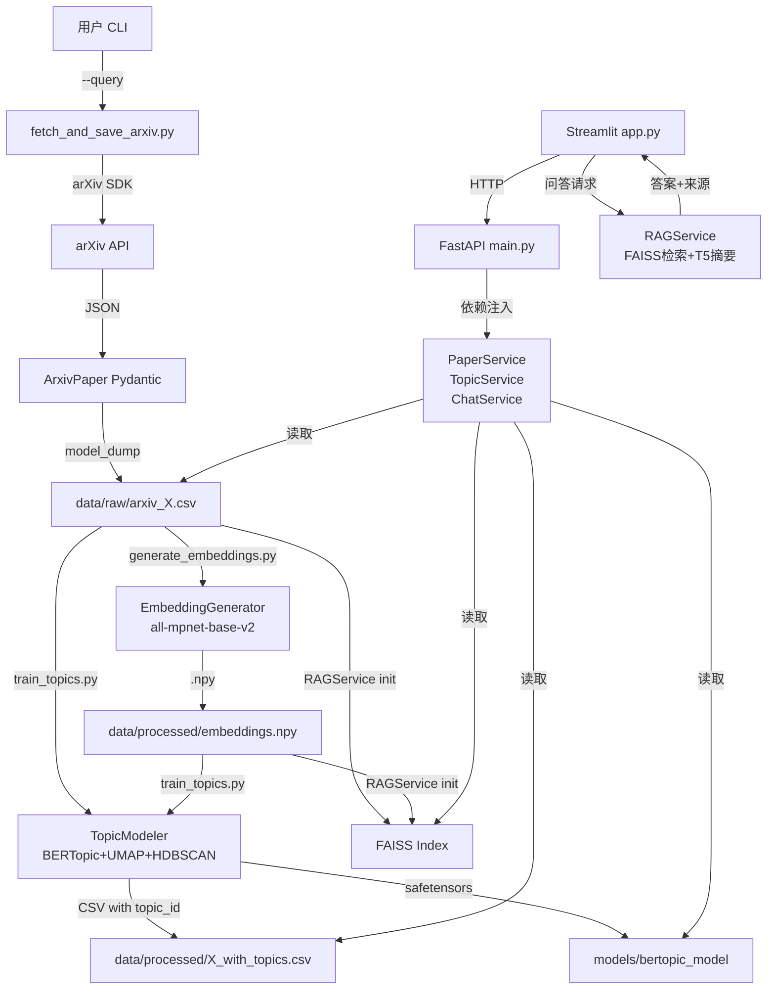

# 科研文献综述 AI 助手 — 项目状态评估报告

> 来源：GitHub PR #1 (https://github.com/puff-l/Ai-assistant-project/pull/1)
> 评估时间：2026-04-16

---

## 一、项目概述

本项目是一个**交互式科研文献综述 AI 助手**，定位是帮助研究者自动抓取、聚类、总结 arXiv 论文，并提供 RAG（检索增强生成）对话功能。整体采用"学习型项目"设计，按阶段推进，代码注释详尽，兼具工程实用性与教学目的。

---

## 二、项目结构总览

```
e:/AIassistant_v2/
├── app.py                        # Streamlit 前端主入口
├── src/
│   ├── main.py                   # FastAPI 后端主入口
│   ├── core/
│   │   ├── config.py             # 路径配置
│   │   ├── arxiv/                # Phase 1: 论文抓取
│   │   │   ├── model.py          # Pydantic 数据模型
│   │   │   ├── client.py         # arXiv API 客户端
│   │   │   └── pipeline.py       # 数据处理管道
│   │   ├── nlp/                  # Phase 2+: NLP 核心
│   │   │   ├── embeddings.py     # 向量生成 (SentenceTransformer)
│   │   │   ├── topic_modeling.py # BERTopic 主题建模
│   │   │   ├── rag.py            # RAG 检索问答 (FAISS)
│   │   │   └── summarizer.py     # 本地摘要生成 (T5/BART)
│   │   └── api/                  # Phase 3: FastAPI 服务层
│   │       ├── models.py         # Pydantic 响应模型
│   │       ├── routes.py         # 论文管理路由
│   │       ├── topic_routes.py   # 主题管理路由
│   │       ├── rag_routes.py     # RAG 对话路由
│   │       ├── services.py       # PaperService
│   │       ├── topic_service.py  # TopicService
│   │       ├── chat_service.py   # ChatService
│   │       └── dependencies.py   # 依赖注入
│   ├── scripts/
│   │   ├── fetch_and_save_arxiv.py  # 抓取脚本
│   │   ├── generate_embeddings.py   # 向量生成脚本
│   │   ├── train_topics.py          # 主题训练脚本
│   │   └── build_vector_store.py    # 向量库构建脚本
│   └── [test files...]
├── data/raw/           # 原始 CSV（待生成）
├── data/processed/     # 向量文件（待生成）
├── data/chroma/        # ChromaDB（预留，未使用）
├── models/             # BERTopic 模型（待生成）
├── docs/               # 后端 API 文档
├── requirements.txt    # 依赖列表（编码异常，见问题）
├── requirements-conda.txt
├── env.example         # 环境变量模板
└── README.md / QUICKSTART.md / PROJECT_COMPLETE.md
```

---

## 三、各阶段实现状态评估

### Phase 1 — 数据获取 ✅ 完成

| 文件 | 状态 | 说明 |
|------|------|------|
| [`src/core/arxiv/model.py`](src/core/arxiv/model.py) | ✅ 完整 | `ArxivPaper` Pydantic 模型，字段齐全 |
| [`src/core/arxiv/client.py`](src/core/arxiv/client.py) | ✅ 完整 | 封装 arXiv SDK，支持排序参数 |
| [`src/core/arxiv/pipeline.py`](src/core/arxiv/pipeline.py) | ✅ 完整 | DataFrame 转换、CSV 保存、数据清洗 |
| [`src/scripts/fetch_and_save_arxiv.py`](src/scripts/fetch_and_save_arxiv.py) | ✅ 完整 | CLI 工具，支持 `--query`、`--max-results`、`--clean` |

**可立即运行**。运行命令：
```bash
cd src
python -m scripts.fetch_and_save_arxiv --query "Transformer" --max-results 100
```

---

### Phase 2 — Embedding & BERTopic 聚类 ✅ 代码完整，需运行数据

| 文件 | 状态 | 说明 |
|------|------|------|
| [`src/core/nlp/embeddings.py`](src/core/nlp/embeddings.py) | ✅ 完整 | `EmbeddingGenerator` 类，使用 `all-mpnet-base-v2`，设置 HF 镜像 |
| [`src/core/nlp/topic_modeling.py`](src/core/nlp/topic_modeling.py) | ✅ 完整 | `TopicModeler` 类，封装 BERTopic + UMAP + HDBSCAN |
| [`src/scripts/generate_embeddings.py`](src/scripts/generate_embeddings.py) | ✅ 完整 | CLI 生成 `.npy` 向量文件 |
| [`src/scripts/train_topics.py`](src/scripts/train_topics.py) | ⚠️ 有 Bug | `import` 路径写成 `from src.core.nlp...`，但脚本在 `src/` 目录运行，会导致 `ModuleNotFoundError` |

**已发现 Bug**：[`src/scripts/train_topics.py`](src/scripts/train_topics.py:8) 第 8 行：
```python
# 错误写法：
from src.core.nlp.topic_modeling import train_topic_model_for_papers
# 正确写法：
from core.nlp.topic_modeling import train_topic_model_for_papers
```

---

### Phase 3 — FastAPI 后端 ✅ 代码完整，依赖数据文件

| 文件 | 状态 | 说明 |
|------|------|------|
| [`src/main.py`](src/main.py) | ✅ 完整 | FastAPI 入口，注册三组路由，配置 CORS |
| [`src/core/api/routes.py`](src/core/api/routes.py) | ✅ 完整 | `/api/papers`、`/api/papers/search`、`/api/stats` |
| [`src/core/api/topic_routes.py`](src/core/api/topic_routes.py) | ✅ 完整 | `/api/topics`、`/api/topics/{id}`、`/api/topics/{id}/papers` |
| [`src/core/api/rag_routes.py`](src/core/api/rag_routes.py) | ✅ 完整 | `/api/chat/init`、`/api/chat/message`、`/api/chat/history` |
| [`src/core/api/services.py`](src/core/api/services.py) | ✅ 完整 | `PaperService`，支持读取、搜索、ID 查询 |
| [`src/core/api/topic_service.py`](src/core/api/topic_service.py) | ✅ 完整 | `TopicService`，可降级（无模型时从名称生成关键词）|
| [`src/core/api/chat_service.py`](src/core/api/chat_service.py) | ✅ 完整 | `ChatService`，硬编码依赖 `arxiv_Transformer.csv` |
| [`src/core/api/dependencies.py`](src/core/api/dependencies.py) | ✅ 完整 | 单例依赖注入，硬编码 `arxiv_Transformer.csv` |
| [`src/core/api/models.py`](src/core/api/models.py) | ✅ 完整 | 完整的 Pydantic 响应/请求模型 |

**注意**：启动后端前必须先执行 Phase 1 生成 `data/raw/arxiv_Transformer.csv`。

---

### Phase 4 — Streamlit 前端 ✅ 代码完整

| 文件 | 状态 | 说明 |
|------|------|------|
| [`app.py`](app.py) | ✅ 完整 | 对话式 UI，健康检查、会话管理、来源展示 |

**注意**：[`app.py`](app.py:3) 顶部注释中路径为 `D:\dataScienceProjects\AI_Assistant\app.py`，与实际部署路径不符（遗留注释，不影响运行）。

---

### Phase 5 — RAG + 本地摘要 ✅ 代码完整，需要模型下载

| 文件 | 状态 | 说明 |
|------|------|------|
| [`src/core/nlp/rag.py`](src/core/nlp/rag.py) | ✅ 完整 | `RAGService`，FAISS 向量检索 + 会话管理 |
| [`src/core/nlp/summarizer.py`](src/core/nlp/summarizer.py) | ✅ 完整 | `PaperSummarizer`（BART）+ `LightweightSummarizer`（T5）工厂模式 |
| [`src/scripts/build_vector_store.py`](src/scripts/build_vector_store.py) | ⚠️ 有 Bug | 第 36 行引用未定义变量 `PROCESSED_DATA_DIR`（缺少 import）|

**已发现 Bug**：[`src/scripts/build_vector_store.py`](src/scripts/build_vector_store.py:36) 第 36 行默认值引用 `PROCESSED_DATA_DIR`，但此模块未导入该变量，会在 argparse 初始化时报 `NameError`。

---

## 四、代码质量评估

### 优点

| 维度 | 评价 |
|------|------|
| **模块化** | 层次清晰：`core/arxiv`、`core/nlp`、`core/api`、`scripts` 职责分明 |
| **代码注释** | 函数均有 docstring，包含参数说明、返回值、使用示例，教学目的突出 |
| **Pydantic 使用** | 请求/响应模型规范，数据验证完整，含字段约束（`min_length`、`ge`、`le`）|
| **错误处理** | 服务层有 `FileNotFoundError` 提示、NaN 值处理、降级逻辑 |
| **依赖注入** | FastAPI 路由通过 `Depends()` 管理服务实例，单例模式正确 |
| **可扩展性** | 摘要器使用工厂模式，支持 light/balanced/full 三档 |

### 问题与风险

| 优先级 | 问题 | 位置 | 影响 |
|--------|------|------|------|
| 🔴 高 | `requirements.txt` 文件编码异常（每字符间有空格，UCS-2 BE BOM） | [`requirements.txt`](requirements.txt) | `pip install -r requirements.txt` 会直接失败 |
| 🔴 高 | `train_topics.py` 导入路径错误 `from src.core.nlp...` | [`src/scripts/train_topics.py`](src/scripts/train_topics.py:8) | Phase 2 训练脚本无法运行 |
| 🔴 高 | `build_vector_store.py` 引用未导入的 `PROCESSED_DATA_DIR` | [`src/scripts/build_vector_store.py`](src/scripts/build_vector_store.py:36) | 脚本启动即崩溃 |
| 🟡 中 | 数据路径硬编码为 `arxiv_Transformer.csv` | [`src/core/api/dependencies.py`](src/core/api/dependencies.py:25)、[`src/core/api/chat_service.py`](src/core/api/chat_service.py:90) | 换数据集需手动修改代码 |
| 🟡 中 | `RAGService` 内部临时实例化 `PaperService("")` 进行行转换 | [`src/core/nlp/rag.py`](src/core/nlp/rag.py:222) | 循环依赖隐患，空路径会触发警告 |
| 🟡 中 | `requirements.txt` 中 PyTorch 版本固定为 2.1.2 CPU 版 | [`requirements.txt`](requirements.txt) | GPU 用户需手动更换；版本可能与 transformers 4.41.0 不兼容 |
| 🟡 中 | `TopicModeler.get_topic()` 返回类型注解写成 `List[Tuple(str,float)]` | [`src/core/nlp/topic_modeling.py`](src/core/nlp/topic_modeling.py:166) | `Tuple(...)` 是错误写法（应为 `Tuple[str, float]`），不影响运行但类型提示错误 |
| 🟢 低 | `app.py` 顶部注释路径为旧机器路径 | [`app.py`](app.py:3) | 不影响运行，仅混淆 |
| 🟢 低 | `data/chroma/` 目录存在但 ChromaDB 未被任何代码使用 | [`data/chroma/`](data/chroma/) | `env.example` 中有配置项，但实际 RAG 使用 FAISS，ChromaDB 是规划中功能 |
| 🟢 低 | `_row_to_paper` 逻辑在 `PaperService` 和 `TopicService` 中重复 | [`src/core/api/services.py`](src/core/api/services.py:26)、[`src/core/api/topic_service.py`](src/core/api/topic_service.py:205) | 代码重复，可提取到公共函数 |
| 🟢 低 | `docs/BACKEND_README.md` 中 RAG 端点标记为"待实现"，但代码已实现 | [`docs/BACKEND_README.md`](docs/BACKEND_README.md:302) | 文档与代码不同步 |

---

## 五、数据流架构



---

## 六、依赖说明

| 类别 | 关键包 | 版本 | 备注 |
|------|--------|------|------|
| 数据抓取 | `arxiv` | 2.1.0 | 官方 SDK |
| 数据处理 | `pandas` | 2.2.0 | |
| 数据验证 | `pydantic` + `pydantic-settings` | 2.6.0 / 2.1.0 | |
| 向量化 | `sentence-transformers` | 2.3.1 | 依赖 torch |
| 主题建模 | `bertopic` | 0.16.0 | 依赖 umap-learn、hdbscan |
| 降维 | `umap-learn` | 0.5.5 | Windows 需 conda 安装 |
| 聚类 | `hdbscan` | 0.8.33 | Windows 需 conda 安装 |
| 向量检索 | `faiss-cpu` | ≥1.7.4 | 未使用 ChromaDB |
| LLM 摘要 | `transformers` | 4.41.0 | T5/BART 本地推理 |
| 深度学习 | `torch` | 2.1.2 CPU | 无 GPU 支持 |
| 后端框架 | `fastapi` + `uvicorn` | 0.109.2 / 0.27.1 | |
| 前端框架 | `streamlit` | 1.31.0 | |
| LLM 集成 | `langchain` + `openai` + `chromadb` | 多版本 | 已导入但**未在实际代码中使用** |

> **注意**：`langchain`、`openai`、`chromadb` 已列入依赖，但当前代码并未调用，属于未来规划预留。

---

## 七、运行流程（修复 Bug 后）

```bash
# 1. 创建环境
conda create -n literature_review python=3.10 -y
conda install -n literature_review -c conda-forge hdbscan umap-learn scikit-learn numpy pandas -y
conda activate literature_review
pip install -r requirements-conda.txt  # 注意：requirements.txt 编码异常，用 conda 版本

# 2. Phase 1: 抓取论文
cd src
python -m scripts.fetch_and_save_arxiv --query "Transformer" --max-results 200

# 3. Phase 2: 生成向量
python -m scripts.generate_embeddings \
  --input ../data/raw/arxiv_Transformer.csv \
  --output ../data/processed/embeddings.npy

# 4. Phase 2: 训练主题（修复 Bug 后）
python -m scripts.train_topics \
  --csv ../data/raw/arxiv_Transformer.csv \
  --embeddings ../data/processed/embeddings.npy \
  --output ../models/bertopic_model

# 5. Phase 3: 启动后端
uvicorn main:app --reload
# 访问 http://localhost:8000/docs

# 6. Phase 4: 启动前端（新终端）
cd ..
streamlit run app.py
# 访问 http://localhost:8501
```

---

## 八、需优先修复的问题清单

- [ ] **修复 `requirements.txt` 编码**：重新以 UTF-8 无 BOM 格式保存，确保 `pip install` 正常
- [ ] **修复 `train_topics.py` 导入路径**：第 8 行 `from src.core.nlp...` → `from core.nlp...`
- [ ] **修复 `build_vector_store.py` 缺失 import**：添加 `from core.config import PROCESSED_DATA_DIR`
- [ ] **更新 `docs/BACKEND_README.md`**：RAG 端点已实现，更新状态标记
- [ ] **提取公共 `_row_to_paper`**：避免 `PaperService` 与 `TopicService` 重复实现
- [ ] **修复类型注解**：`topic_modeling.py` 第 166 行 `Tuple(str,float)` → `Tuple[str, float]`

---

## 九、总结

| 维度 | 评分 | 说明 |
|------|------|------|
| **代码完整性** | 4/5 | 全部 5 个 Phase 代码均存在，仅有少数 Bug |
| **架构设计** | 4/5 | 分层清晰，依赖注入规范，循环依赖是隐患 |
| **代码质量** | 3.5/5 | 注释优秀，但有重复代码和类型注解错误 |
| **文档完整性** | 3.5/5 | 文档丰富但部分与代码不同步 |
| **可运行性** | 3/5 | Phase 1 可直接运行；Phase 2-5 需先修复 Bug |
| **工程化程度** | 3.5/5 | 有配置管理、错误处理，缺少日志系统、测试覆盖 |

**整体结论**：项目结构完整、思路清晰，是一个教学价值与实用价值兼备的 AI 应用项目。当前主要问题集中在少数可快速修复的 Bug（`requirements.txt` 编码、导入路径错误）。修复这些问题后，完整的数据获取→向量化→主题建模→后端 API→前端对话 链路可以完整运行。
